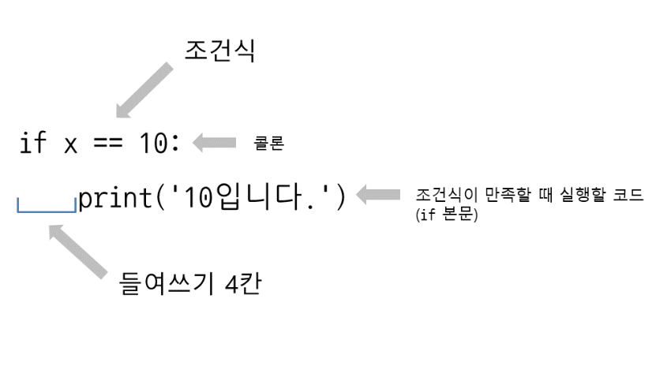
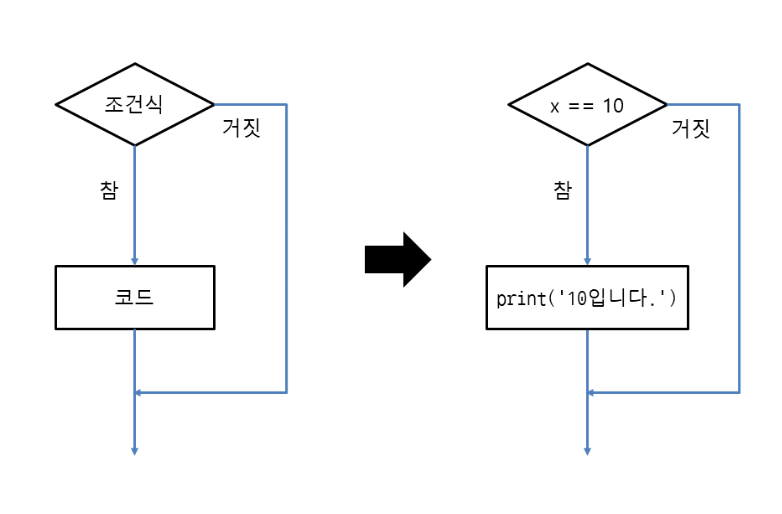
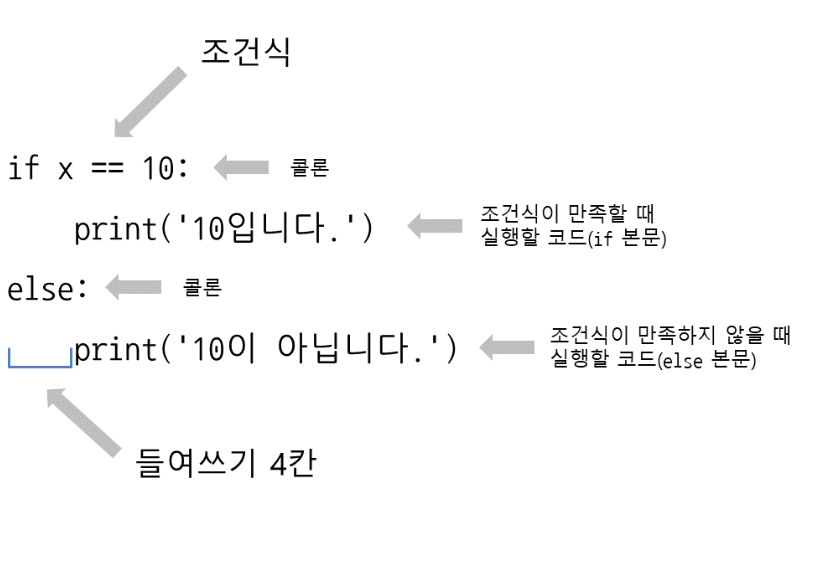
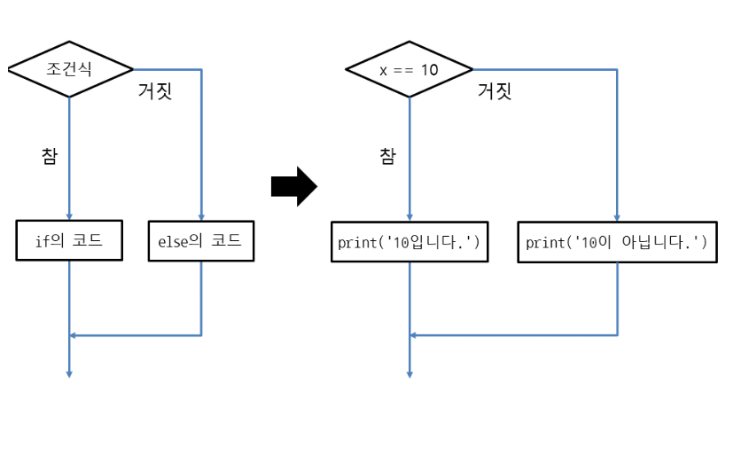

# if 조건문 사용하기
- 특정한 조건일 때 코드를 실행하는 문법
```
if 세탁 완료 소리가 울리면:
    빨래를 꺼내서 말린다.

if 비가 온다면:
    우산을 가지고 나간다.
 
if 날씨가 춥다면:
    코트를 입고 나간다.
 
if 날씨가 덥다면:
    반소매에 얇은 옷을 입고 나간다.
```

## if 조건문 사용
```
if 조건식:
     코드
```
```
>>> x = 10
>>> if x == 10:
...      print('10입니다.')
... 
10입니다.
```

## 조건문의 기본 형태와 실행 흐름
- if 조건식 : 형식 으로 사용하며 그 다음 줄에는 들여쓰기를 한 뒤 조건식이 만족할 때 실행할 코드를 넣음
- 조건식이 만족할 때 실행할 코드를 if 본문이라고 함

- 조건문의 실행 흐름 표현


## if 조건문에서 코드 생략하기
- if 조건문에서 조건식만 작성하고 코드를 생략 pass
- pass 는 아무 일도 하지 않고 그냥 넘어간 뜻
- 아무 일도 하지 않는 코드라 의미가 없지만 나중에 작성해야 할 코드를 표시할 때 사용할 수 있음
- pass만 넣고 나중에 할일은 주석으로 남겨 놓는 방식

```
if x == 10:
    pass    # TODO: x가 10일 때 처리가 필요함
```

## 중첩 조건문 사용
```
x = 15
 
if x >= 10:
     print('10 이상입니다.')
 
     if x == 15:
         print('15입니다.')
 
     if x == 20:
         print('20입니다.')
```

## 사용자가 입력한 값에 if 조건문 사용하기
```
x = int(input())          # 입력받은 값을 변수에 저장
 
if x == 10:               # x가 10이면
    print('10입니다.')    # '10입니다.'를 출력
 
if x == 20:               # x가 20이면
    print('20입니다.')    # '20입니다.'를 출력
```

## else를 사용하여 두 방향으로 분기하기
- else는 if 조건문 뒤에 오며 단독으로 사용할 수 없음
- if와 마찬가지로 else도 :(콜론)을 붙이며 다음 줄에 실행할 코드가 옴

```
if 조건식:
     코드1
else:
     코드2
```
- 조건문의 실행 흐름 표현


## 조건문의 동작 방식 알아보기
```
if True:
    print('참')    # True는 참
else:
    print('거짓')
 
if False:
    print('참')
else:
    print('거짓')    # False는 거짓
 
if None:
    print('참')
else:
    print('거짓')    # None은 거짓
```

## 조건문에 숫자 지정하기
- 숫자는 정수, 실수와 관계 없이 0이면 거짓 , 나머지는 참
```
if 0:
    print('참')
else:
    print('거짓')    # 0은 거짓
 
if 1:
    print('참')    # 1은 참
else:
    print('거짓')
 
if 0x1F:    # 16진수
    print('참')    # 0x1F는 참
else:
    print('거짓')
 
if 0b1000:    # 2진수
    print('참')    # 0b1000은 참
else:
    print('거짓')
 
if 13.5:    # 실수
    print('참')    # 13.5는 참
else:
    print('거짓')
```

## True, False 로 취급하는 것들
```
파이썬 문법 중에서 False로 취급하는 것들입니다.

None

False

0인 숫자들: 0, 0.0, 0j

비어 있는 문자열, 리스트, 튜플, 딕셔너리, 세트: '', "", [], (), {}, set()

클래스 인스턴스의 __bool__(), __len__() 메서드가 0 또는 False를 반환할 때

앞에서 나열한 것들을 제외한 모든 요소들은 True
```

## 조건식을 여러개 지정하기
```
if 포털 사이트 회원인지? 그리고 중고나라 회원인지?:
    글쓰기 화면 표시
else:
    포털 사이트 또는 중고나라 회원이 아니므로 글을 쓸 수 없다는 경고 문구 표시

x = 10
y = 20
 
if x == 10 and y == 20:     # x가 10이면서 y가 20일 때
    print('참')
else:
    print('거짓')
```

## 중첩 if 조건문과 논리 연산자
1. if 중첩으로
```
if x > 0:
    if x < 20:
        print('20보다 작은 양수입니다.')
```
2. 논리 연산자
```
if x > 0 and x < 20:
    print('20보다 작은 양수입니다.')
```
3. 파이썬 축약 문법
```
if 0 < x < 20:
    print('20보다 작은 양수입니다.')
```

# elif 를 사용하여 여러 방향으로 분기
- 프로그램 제작시 여러 분기 처리가 필요
```
if 조건식:
    코드1
elif 조건식:
    코드2
else:
    코드3
```
```
if 콜라 버튼을 눌렀다면:
    콜라를 내보냄
elif 사이다 버튼을 눌렀다면:
    사이다를 내보냄
elif 환타 버튼을 눌렀다면:
    환타를 내보냄:
else:
    제공하지 않는 메뉴
```

## 음료수 자판기 만들기
```
button = int(input())
 
if button == 1:
    print('콜라')
elif button == 2:
    print('사이다')
elif button == 3:
    print('환타')
else:
    print('제공하지 않는 메뉴')
```