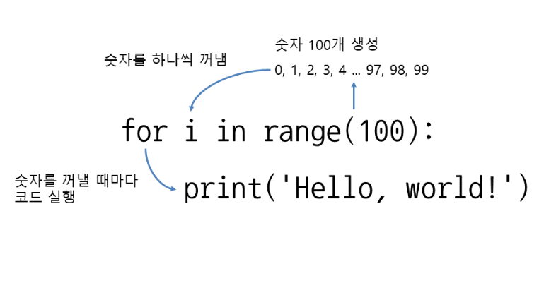
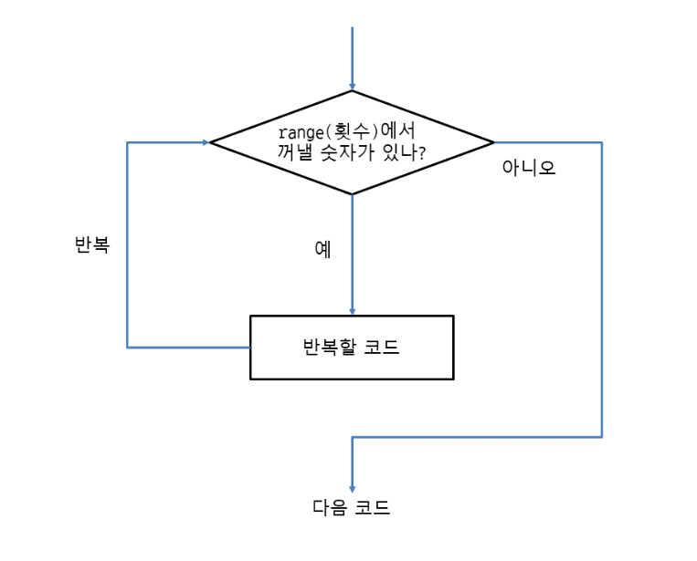

# for range 반복문 사용
```
for 변수 in range(횟수):
     반복할 코드
```



# for range 응용하기
## 시작하는 숫자와 끝나는 숫자 지정하기
- for 변수 in range(시작, 끝):
```
>>> for i in range(5, 12):    # 5부터 11까지 반복
...     print('Hello, world!', i)
```
## 증가폭 사용하기
- for 변수 in range(시작, 끝, 증가폭):
```
>>> for i in range(0, 10, 2):    # 0부터 8까지 2씩 증가
...     print('Hello, world!', i)
```

## 숫자를 감소시키기
- for 변수 in reversed(range(횟수))
- for 변수 in reversed(range(시작, 끝))
- for 변수 in reversed(range(시작, 끝, 증가폭))
```
>>> for i in range(10, 0, -1):    # 10에서 1까지 1씩 감소
...     print('Hello, world!', i)

>>> for i in reversed(range(10)):    # range에 reversed를 사용하여 숫자의 순서를 반대로 뒤집음
...     print('Hello, world!', i)    # 9부터 0까지 10번 반복
```

## 입력한 횟수대로 반복하기
```
count = int(input('반복할 횟수를 입력하세요: '))
 
for i in range(count):
    print('Hello, world!', i)
```

## 시퀀스 객체로 반복하기
- for 에 range 대신에 시퀀스 객체를 넣어도 됨
- for에는 리스트, 튜플, 문자열 등 시퀀스 객체로 반복할 수 있음
- 각 시퀀스 객체의 요소를 꺼내면서 반복
```
a = [10, 20, 30, 40, 50]
for i in a:
     print(i)

fruits = ('apple', 'orange', 'grape')
for fruit in fruits:
    print(fruit)

for letter in 'Python':
    print(letter, end=' ')

for letter in reversed('Python'):
    print(letter, end=' ')
```