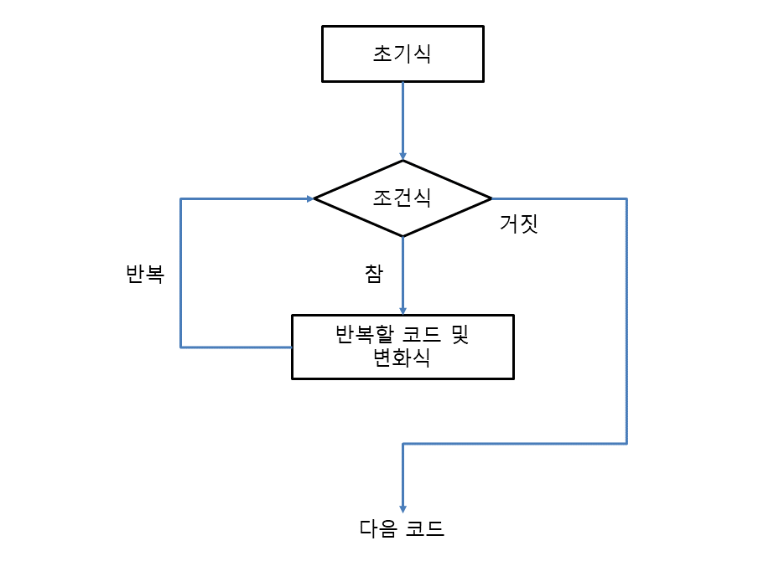
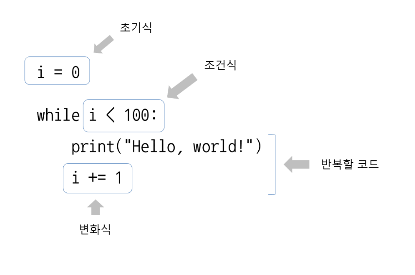

# while 반복문 사용
```
초기식
while 조건식:
     반복할 코드
     변화식
```
```
i = 0                     # 초기식
while i < 100:            # while 조건식
     print('Hello, world!')    # 반복할 코드
     i += 1                    # 변화식
```



## 반복할 횟수가 정해지지 않은 경우
- while 반복문은 반복 횟수가 정해지지 않았을 때 주로 사용
```
import random    # random 모듈을 가져옴
 
i = 0
while i != 3:    # 3이 아닐 때 계속 반복
    i = random.randint(1, 6)    # randint를 사용하여 1과 6 사이의 난수를 생성
    print(i)
```