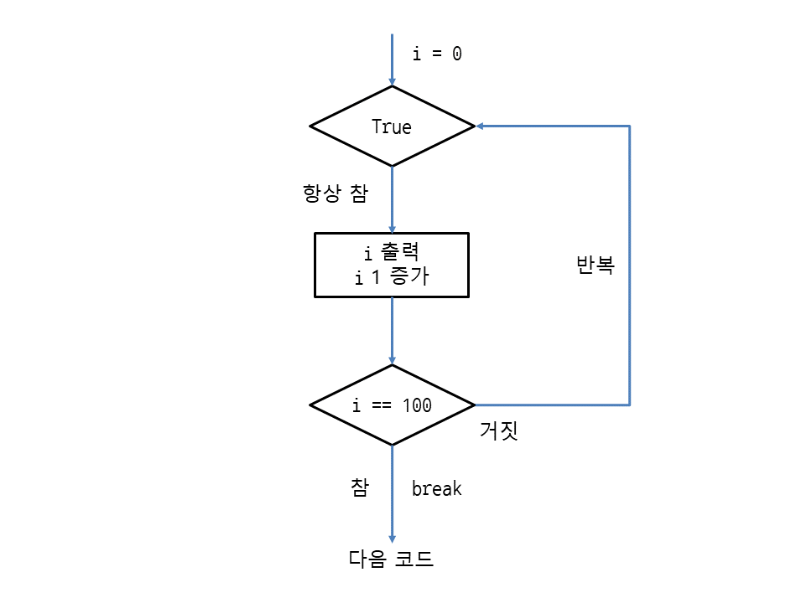
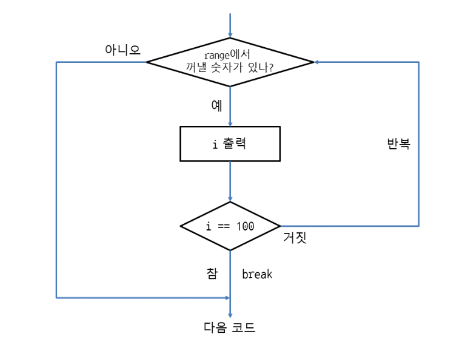
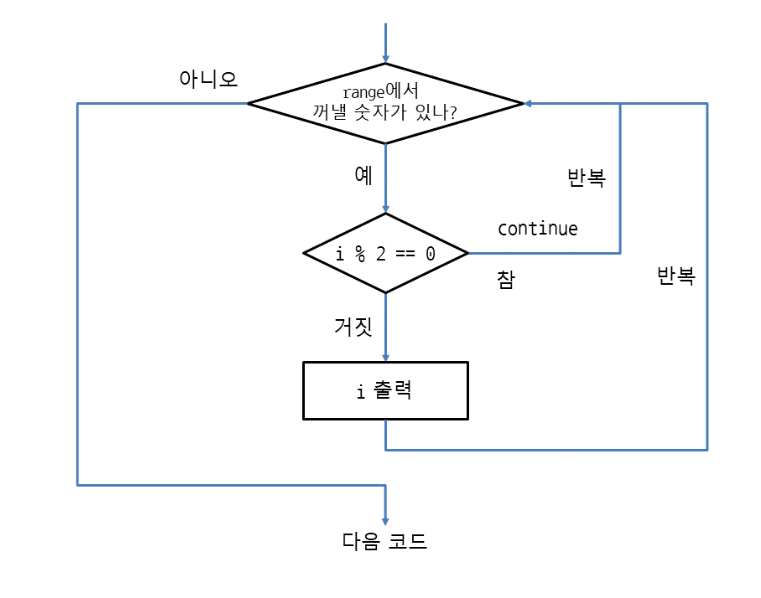

## break 로 반복문 끝내기

```
i = 0
while True:    # 무한 루프
    print(i)
    i += 1          # i를 1씩 증가시킴
    if i == 100:    # i가 100일 때
        break       # 반복문을 끝냄. while의 제어흐름을 벗어남
```

```
for i in range(10000):    # 0부터 9999까지 반복
    print(i)
    if i == 100:    # i가 100일 때
        break       # 반복문을 끝냄. for의 제어흐름을 벗어남
```


## continue로 코드 실행 건너뛰기
- 일부 코드를 실행하지 않고 건너 뛸수 있음
```
# 홀수만 출력

for i in range(100):       # 0부터 99까지 증가하면서 100번 반복
    if i % 2 == 0:         # i를 2로 나누었을 때 나머지가 0면 짝수
        continue           # 아래 코드를 실행하지 않고 건너뜀
    print(i)
```
```
i = 0
while i < 100:        # i가 100보다 작을 때 반복. 0부터 99까지 증가하면서 100번 반복
    i += 1            # i를 1씩 증가시킴
    if i % 2 == 0:    # i를 2로 나누었을 때 나머지가 0이면 짝수
        continue      # 아래 코드를 실행하지 않고 건너뜀
    print(i)
```


## 입력한 횟수대로 반복하기
```
count = int(input('반복할 횟수를 입력하세요: '))
 
i = 0
while True:    # 무한 루프
    print(i)
    i += 1
    if i == count:    # i가 입력받은 값과 같을 때
        break         # 반복문을 끝냄
```