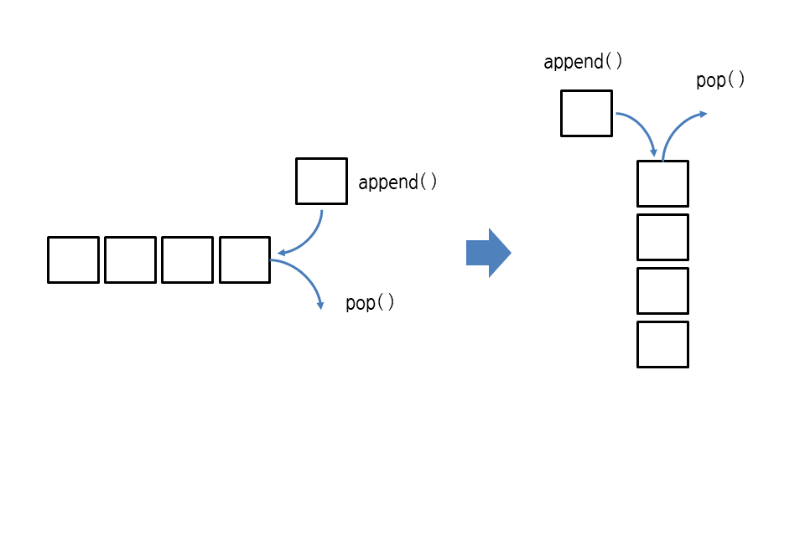
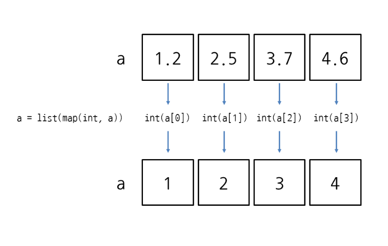

# 리스트와 튜플 응용하기

## 리스트에 요소 추가하기
- append: 요소 하나를 추가
- extend: 리스트를 연결하여 확장
- insert: 특정 인덱스에 요소 추가
    - insert(0, 요소): 리스트의 맨 처음에 요소를 추가
    - insert(len(리스트), 요소): 리스트 끝에 요소를 추가
```
>>> a = [10, 20, 30]
>>> a.append(500)
>>> a
[10, 20, 30, 500]
>>> len(a)
4

>>> a = []
>>> a.append(10)
>>> a
[10]

>>> a = [10, 20, 30]
>>> a.append([500, 600])
>>> a
[10, 20, 30, [500, 600]]
>>> len(a)
4
```

```
>>> a = [10, 20, 30]
>>> a.extend([500, 600])
>>> a
[10, 20, 30, 500, 600]
>>> len(a)
5
```

```
>>> a = [10, 20, 30]
>>> a.insert(2, 500)
>>> a
[10, 20, 500, 30]
>>> len(a)
4

>>> a = [10, 20, 30]
>>> a.insert(0, 500)
>>> a
[500, 10, 20, 30]

>>> a = [10, 20, 30]
>>> a.insert(len(a), 500)
>>> a
[10, 20, 30, 500]

>>> a = [10, 20, 30]
>>> a.insert(1, [500, 600])
>>> a
[10, [500, 600], 20, 30]

>>> a = [10, 20, 30]
>>> a[1:1] = [500, 600]
>>> a
[10, 500, 600, 20, 30]
```


## 리스트에서 요소 삭제하기
- pop: 마지막 요소 또는 특정 인덱스의 요소를 삭제
- remove: 특정 값을 찾아서 삭제


```
>>> a = [10, 20, 30]
>>> a.pop()
30
>>> a
[10, 20]

>>> a = [10, 20, 30]
>>> a.pop(1)
20
>>> a
[10, 30]

>>> a = [10, 20, 30]
>>> del a[1]
>>> a
[10, 30]


>>> a = [10, 20, 30]
>>> a.remove(20)
>>> a
[10, 30]

>>> a = [10, 20, 30, 20]
>>> a.remove(20)
>>> a
[10, 30, 20]
```
## 리스트로 스택과 큐 만들기


```
지금까지 알아본 리스트의 메서드로 스택(stack)과 큐(queue)를 만들 수 있습니다. 다음과 같이 append와 pop을 호출하는 그림을 90도 돌리면 스택의 모습이 됩니다.

여기서 pop() 대신 pop(0)을 사용하면 큐가 됩니다.

물론 append(), pop(0)이 아닌 insert(0, 요소), pop()을 사용해서 추가/삭제 방향을 반대로 해도 큐가 됩니다.

파이썬에서 스택은 리스트를 그대로 활용해도 되지만, 큐는 좀 더 효율적으로 사용할 수 있도록 덱(deque, double ended queue)이라는 자료형을 제공합니다. 덱은 양쪽 끝에서 추가/삭제가 가능한 자료 구조입니다.

deque(반복가능한객체)

>>> from collections import deque    # collections 모듈에서 deque를 가져옴
>>> a = deque([10, 20, 30])
>>> a
deque([10, 20, 30])
>>> a.append(500)    # 덱의 오른쪽에 500 추가
>>> a
deque([10, 20, 30, 500])
>>> a.popleft()     # 덱의 왼쪽 요소 하나 삭제
10
>>> a
deque([20, 30, 500])
deque의 append는 덱의 오른쪽에 요소를 추가하고, popleft는 덱의 왼쪽 요소를 삭제합니다. 반대로 appendleft는 덱의 왼쪽에 요소를 추가하고, pop으로 덱의 오른쪽 요소를 삭제할 수도 있습니다.
```

## 리스트에서 특정 값의 인덱스 구하기
- index(값): 특정 값의 인덱스를 찾음
```
>>> a = [10, 20, 30, 15, 20, 40]
>>> a.count(20)
2
```

## 특정 값의 개수 구하기
- count(값): 리스트에서 특정 값의 개수를 구함


```
>>> a = [10, 20, 30, 15, 20, 40]
>>> a.count(20)
2
```
## 리스트의 순서 뒤집기
- reverse(): 리스트에서 요소의 순서를 반대로 뒤집음
```
>>> a = [10, 20, 30, 15, 20, 40]
>>> a.reverse()
>>> a
[40, 20, 15, 30, 20, 10]
```
## 리스트의 요소를 정렬하기
- sort() 또는 sort(reverse=False): 리스트의 값을 작은 순서대로 정렬(오름차순)
- sort(reverse=True): 리스트의 값을 큰 순서대로 정렬(내림차순)
```
>>> a = [10, 20, 30, 15, 20, 40]
>>> a.sort()
>>> a
[10, 15, 20, 20, 30, 40]

>>> a = [10, 20, 30, 15, 20, 40]
>>> a.sort()    # a의 내용을 변경하여 정렬
>>> a
[10, 15, 20, 20, 30, 40]
>>> b = [10, 20, 30, 15, 20, 40]
>>> sorted(b)    # 정렬된 새 리스트를 생성
[10, 15, 20, 20, 30, 40]
```
## 모든 리스트의 요소를 삭제하기
- clear(): 리스트의 모든 요소 삭제
-  del a[:]
```
>>> a = [10, 20, 30]
>>> a.clear()
>>> a
[]

>>> a = [10, 20, 30]
>>> del a[:]
>>> a
[]
```
## 리스트를 슬라이스로 조작하기\

```
>>> a = [10, 20, 30]
>>> a[len(a):] = [500]
>>> a
[10, 20, 30, 500]

>>> a = [10, 20, 30]
>>> a[len(a):] = [500, 600]
>>> a
[10, 20, 30, 500, 600]
```

## 리스트가 비어있는지 확인 하기
```
리스트(시퀀스 객체)가 비어 있는지 확인하려면 어떻게 해야 할까요? 방법은 간단합니다. 리스트는 len 함수로 길이를 구할 수 있죠? 이걸 if 조건문으로 판단하면 리스트가 비어 있는지 확인할 수 있습니다.

if not len(seq):    # 리스트가 비어 있으면 True
if len(seq):        # 리스트에 요소가 있으면 True
하지만 파이썬에서는 이 방법보다 리스트(시퀀스 객체)를 바로 if 조건문으로 판단하는 방법을 권장합니다(PEP 8).

if not seq:    # 리스트가 비어 있으면 True
if seq:        # 리스트에 내용이 있으면 True
특히 리스트가 비어 있는지 확인하는 방법은 리스트의 마지막 요소에 접근할 때 유용하게 사용할 수 있습니다. 리스트의 마지막 요소에 접근할 때는 인덱스를 -1로 지정하면 되죠?

>>> seq = [10, 20, 30]
>>> seq[-1]
30
만약 리스트가 비어 있을 경우에는 인덱스를 -1로 지정하면 에러가 발생합니다.

>>> a = []
>>> a[-1]
Traceback (most recent call last):
  File "<pyshell#3>", line 1, in <module>
    a[-1]
IndexError: list index out of range
이때는 if 조건문을 활용하여 리스트에 요소가 있을 때만 마지막 요소를 가져오면 됩니다.

seq = []
if seq:               # 리스트에 요소가 있는지 확인
    print(seq[-1])    # 요소가 있을 때만 마지막 요소를 가져옴
```
# 리스트의 할당과 복사
## 리스트의 할당과 복사 알아보기
```
a = [0,0,0,0,0,0]
b = a
print(a)
print(b)

이름만 다를 뿐 같은 객체임
같은 객체를 사용하고 있기 때문에 한쪽에서 변경하면 둘다 변경됨

```


## copy 함수로 완전히 분리하여 복사
```
a = [0,0,0,0,0,0]
b = a.copy()

다른 객체로 분리해서 복사
```


## for 반복문으로 요소 출력하기
```
for 변수 in 리스트:
     반복할 코드

>>> a = [38, 21, 53, 62, 19]
>>> for i in a:
...     print(i)    
```

## 인덱스와 요소를 함께 출력하기
- for 인덱스, 요소 in enumerate(리스트):
- for 인덱스, 요소 in enumerate(리스트, start=숫자):

## while 반복문으로 요소 출력하기

```
>>> a = [38, 21, 53, 62, 19]
>>> i = 0
>>> while i < len(a):
...     print(a[i])
...     i += 1
```

## 리스트의 가장 작은수, 가장 큰수 합계 구하기
```
# 리스트의 첫번째 오소를 smallest에 저장
# for로 리스트의 요소를 모두 반복 하면서 i 가 smallest 보다 작으면 smallest에 작은 값을 할당
# 리스트에서 가장 작은 값 찾기 
a = [38, 21, 53, 62, 19]
smallest = a[0]
for i in a:
     if i < smallest:
         smallest = i
print(a)
print('a에서 가장작은 값',smallest)

largest = a[0]
for i in a:
     if i > smallest:
         largest = i
print(a)
print('a에서 가장 큰 값',largest)
```

## 파이썬 min, max 함수 사용
- 리스트, 튜플, 딕셔너리, 세트, range 등에서 사용 가능
```
print('a 리스트의 합계: ',x)
print('min',min(a))
print('max',max(a))
print('sum 리스트 합계',sum(a))
```

## 리스트 표현식
- 파이썬의 리스트가 특이한 점은 리스트 안에 for문과 if 문을 사용 가능(리스트 컴프리헨션 list comprehension)
- 식으로 지정해서 생성된 것
- [식 for 변수 in 리스트]
- list(식 for 변수 in 리스트)

## 리스트 표현식에서 if 조건문 사용하기
- [식 for 변수 in 리스트 if 조건식]
- list(식 for 변수 in 리스트 if 조건식)

## for 반복문과 if 조건문을 여러번 사용하기
```
[식 for 변수1 in 리스트1 if 조건식1     for 변수2 in 리스트2 if 조건식2     ...     for 변수n in 리스트n if 조건식n]
 
list(식 for 변수1 in 리스트1 if 조건식1         for 변수2 in 리스트2 if 조건식2         ...         for 변수n in 리스트n if 조건식n)
```


## 리스트에 map 사용하기
- map 은 리스트의 요소를 지정된 함수로 처리해 주는 함수
- 원본 리스트를 변경하지 않고 새 리스트를 생성
- list(map(함수, 리스트))
- tuple(map(함수, 튜플))
```
>>> a = [1.2, 2.5, 3.7, 4.6]
>>> for i in range(len(a)):
...     a[i] = int(a[i])
...
>>> a
[1, 2, 3, 4]
```


## input().split() 와 map
- 지금까지 input().split()으로 값을 여러 개 입력받고 정수, 실수로 변환할 때도 map을 사용했었죠? 사실 input().split()의 결과가 문자열 리스트라서 map을 사용할 수 있었음

## 튜플 응용하기
## 튜플에서 특정 값의 인덱스 구하기
```
>>> a = (38, 21, 53, 62, 19, 53)
>>> a.index(53)
2
```

## 특정 값의 개수 구하기
```
>>> a = (10, 20, 30, 15, 20, 40)
>>> a.count(20)
2
```

## for 반복문으로 요소 출력하기
```
>>> a = (38, 21, 53, 62, 19)
>>> for i in a:
...     print(i, end=' ')
...
38 21 53 62 19
```

## 튜플 표현식 사용하기
- tuple(식 for 변수 in 리스트 if 조건식)
```
>>> a = tuple(i for i in range(10) if i % 2 == 0)
>>> a
(0, 2, 4, 6, 8)

참고로 ( )(괄호) 안에 표현식을 넣으면 튜플이 아니라 제너레이터 표현식이 됨

>>> (i for i in range(10) if i % 2 == 0)
<generator object <genexpr> at 0x050FE420>
```

## 튜플에 map 사용하기

## 튜플에서 가장 작은 수 , 가장 큰수 , 합계 구하기
