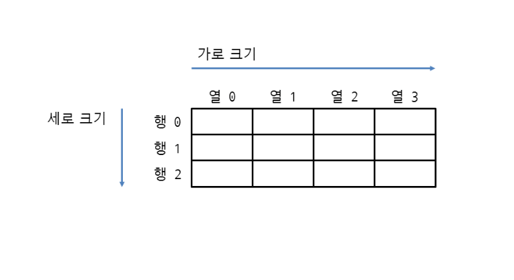
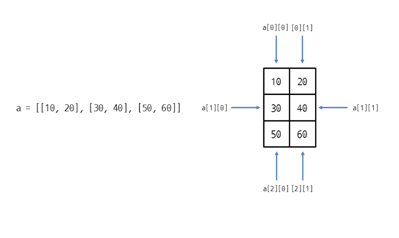
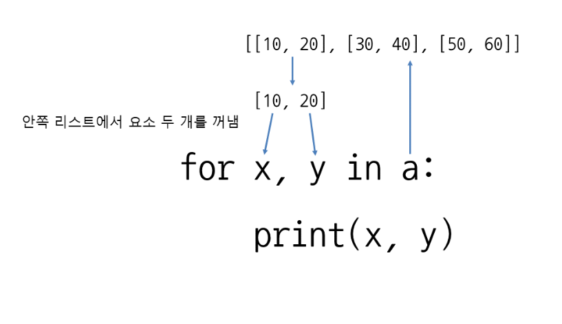
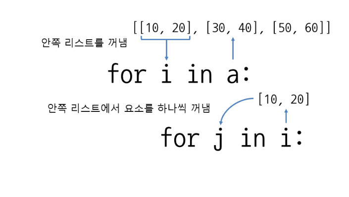

# 2차원 리스트의 요소 접근하기
- 2차원 리스트는 다음과 같이 가로 x 세로 형태로 이루어져 있으며 행(row)과 열(column)로 모두 0 부터 시작


- 2차원 리스트는 리스트 안에 리스트를 넣어서 만들 수 있으며 안쪽의 각 리스트는 ,(콤마)로 구분
- 리스트 = [[값, 값], [값, 값], [값, 값]]
```
>>> a = [[10, 20], [30, 40], [50, 60]]
>>> a
[[10, 20], [30, 40], [50, 60]]
```

## 2차원 리스트의 요소에 접근하기
- 리스트[세로인덱스][가로인덱스]
- 리스트[세로인덱스][가로인덱스] = 값


## 톱니형 리스트
- 파이썬에서는 가로 크기가 불규칙한 톱니형 리스트로 만들수 있음
```
a = [[10, 20],
     [500, 600, 700],
     [9],
     [30, 40],
     [8],
     [800, 900, 1000]]

>>> a = []
>>> a.append([])
>>> a[0].append(10)
>>> a[0].append(20)
>>> a.append([])
>>> a[1].append(500)
>>> a[1].append(600)
>>> a[1].append(700)
>>> a
[[10, 20], [500, 600, 700]]
```

## 2차원 튜플
- 튜플 안에 튜플을 넣는 방식
- 튜플 안에 리스트를 넣는 방식
- 리스트 안에 튜플을 넣는 방식 등이 가능
- 튜플은 내용을 변경할 수 없으므로 a는 안쪽과 바깥쪽 모두 요소를 변경할 수 없음
-  b는 안쪽 리스트만 요소를 변경할 수 있고, c는 바깥쪽 리스트만 요소를 변경할 수 있음
```
튜플 = ((값, 값), (값, 값), (값, 값))

튜플 = ([값, 값], [값, 값], [값, 값])

리스트 = [(값, 값), (값, 값), (값, 값)]
```
```

a = ((10, 20), (30, 40), (50, 60))    # 튜플 안에 튜플을 넣은 2차원 튜플
b = ([10, 20], [30, 40], [50, 60])    # 튜플 안에 리스트를 넣음
c = [(10, 20), (30, 40), (50, 60)]    # 리스트 안에 튜플을 넣음

```

## 사람이 알아보기 쉽게 출력하기
- indent는 들여쓰기 칸 수, width는 가로 폭

## 반복문으로 2차원 리스트의 요소를 모두 출력하여 사용



## for 과 range 사용하기
```
a = [[10, 20], [30, 40], [50, 60]]
 
for i in range(len(a)):            # 세로 크기
    for j in range(len(a[i])):     # 가로 크기
        print(a[i][j], end=' ')
    print()
```

## while 반복문을 한번 사용하기
```
i = 0
while i < len(a):    # 반복할 때 리스트의 크기 활용(세로 크기)
    x, y = a[i]      # 요소 두 개를 한꺼번에 가져오기
    print(x, y)
    i += 1           # 인덱스를 1 증가시킴
```

## 반복문으로 리스트 만들기
## for 반복문으로 1차원 리스트 만들기
```
a = []    # 빈 리스트 생성
 
for i in range(10):
    a.append(0)    # append로 요소 추가
 
print(a)
```
##  for 반복문으로 2차원 리스트 만들기
```
a = []    # 빈 리스트 생성
print(a)
for i in range(3):
    line = []              # 안쪽 리스트로 사용할 빈 리스트 생성
    for j in range(2):
        line.append(0)     # 안쪽 리스트에 0 추가
    a.append(line)         # 전체 리스트에 안쪽 리스트를 추가
 
print(a)
pprint(a, indent=4, width=20)
```

## 리스트 표현식으로 2차원 리스트 만들기
```
a = [[0 for j in range(2)] for i in range(3)]
```

## 톱니형 리스트 만들기
```
a = [3, 1, 3, 2, 5]    # 가로 크기를 저장한 리스트
b = []    # 빈 리스트 생성
 
for i in a:      # 가로 크기를 저장한 리스트로 반복
    line = []    # 안쪽 리스트로 사용할 빈 리스트 생성
    for j in range(i):    # 리스트 a에 저장된 가로 크기만큼 반복
        line.append(0)
    b.append(line)        # 리스트 b에 안쪽 리스트를 추가
 
print(b)
```

```
>>> a = [[0] * i for i in [3, 1, 3, 2, 5]]
>>> a
[[0, 0, 0], [0], [0, 0, 0], [0, 0], [0, 0, 0, 0, 0]]
```

## sorted로 2차원 리스트 정렬하기
- 2차원 리스트를 정렬할 때는 sorted 함수를 사용
- sorted(반복가능한객체, key=정렬함수, reverse=True 또는 False)
```
students = [
    ['john', 'C', 19],
    ['maria', 'A', 25],
    ['andrew', 'B', 7]
]
 
print(sorted(students, key=lambda student: student[1]))  # 안쪽 리스트의 인덱스 1을 기준으로 정렬
print(sorted(students, key=lambda student: student[2]))  # 안쪽 리스트의 인덱스 2를 기준으로 정렬
```

## 2차원 리스트의 할당과 복사
- 2차원 이상의 다차원 리스트는 리스트를 완전히 복사하려면 copy 메서드 대신 copy 모듈의 deepcopy 함수를 사용해야 함
```
>>> a = [[10, 20], [30, 40]]
>>> import copy             # copy 모듈을 가져옴
>>> b = copy.deepcopy(a)    # copy.deepcopy 함수를 사용하여 깊은 복사
>>> b[0][0] = 500
>>> a
[[10, 20], [30, 40]]
>>> b
[[500, 20], [30, 40]]
```