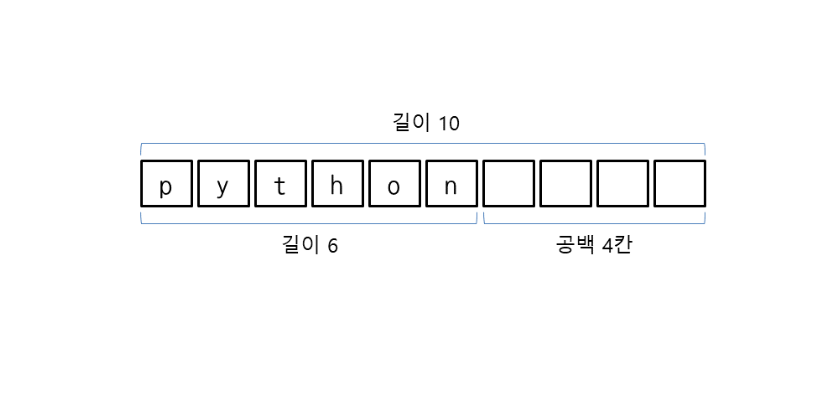
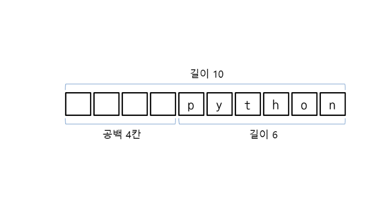
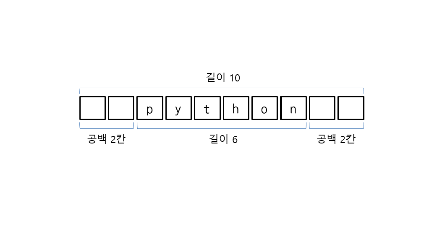

# 문자열 응용하기
## 문자열 바꾸기
- replace('바꿀문자열', '새문자열')
- 문자열 자체는 변경하지 않으며 바뀐 결과를 반환
```
>>> s = 'Hello, world!'
>>> s = s.replace('world!', 'Python')
>>> s
'Hello, Python'
```

## 문자 바꾸기
- translate는 문자열 안의 문자를 다른 문자로 바꿈
-  str.maketrans('바꿀문자', '새문자') => 테이블 생성
- translate(테이블)
- 다음은 문자열 'apple'에서 a를 1, e를 2, i를 3, o를 4, u를 5로 바꿉니다.
```
>>> table = str.maketrans('aeiou', '12345')
>>> 'apple'.translate(table)
'1ppl2'
```
## 문자열 분리하기
- split(): 공백을 기준으로 문자열을 분리하여 리스트로 만듬
- split('기준문자열')과 같이 기준 문자열을 지정하면 기준 문자열로 문자열을 분리
## 구분자 문자열과 문자열 리스트 연결하기
- join(리스트)는 구분자 문자열과 문자열 리스트의 요소를 연결하여 문자열로 만듬

## 소문자를 대문자로 바꾸기
- upper()
- lower()
## 왼쪽 공백 삭제하기
- lstrip()은 문자열에서 왼쪽에 있는 연속된 모든 공백을 삭제
## 오른쪽 공백 삭제하기
- rstrip()은 문자열에서 오른쪽에 있는 연속된 모든 공백을 삭제
## 양쪽 공백 삭제
- strip()은 문자열에서 양쪽에 있는 연속된 모든 공백을 삭제

## 왼쪽 특정 문자 삭제하기
- lstrip('삭제할문자들')과 같이 삭제할 문자들을 문자열 형태로 넣어주면 문자열 왼쪽에 있는 해당 문자를 삭제
## 오른쪽 특정 문자 삭제하기
- rstrip('삭제할문자들')과 같이 삭제할 문자들을 문자열 형태로 넣어주면 문자열 오른쪽에 있는 해당 문자를 삭제
## 양쪽 특정 문자 삭제하기
- strip('삭제할문자들')과 같이 삭제할 문자들을 문자열 형태로 넣어주면 문자열 양쪽에 있는 해당 문자를 삭제
## 문자열을 왼쪽 정렬하기
- 문자열에 공백을 넣어서 원하는 위치에 정렬하는 방법
- ljust(길이)는 문자열을 지정된 길이로 만든 뒤 왼쪽으로 정렬하며 남는 공간을 공백으로 채웁


## 문자열을 오른쪽 정렬하기
- rjust(길이)는 문자열을 지정된 길이로 만든 뒤 오른쪽으로 정렬하며 남는 공간을 공백으로 채웁니다(r은 오른쪽(right)을 의미). 


## 문자열을 가운데 정렬하기
- center(길이)는 문자열을 지정된 길이로 만든 뒤 가운데로 정렬하며 남는 공간을 공백으로 채움


## 메서드 체이닝
- 문자열 메서드는 처리한 결과를 반환하도록 되어 있음
- 해당 메서드를 계속 연결해서 호출하는 메서드 체이닝이 가능


## 문자열 왼쪽에 0 채우기
- zfill(길이)는 지정된 길이에 맞춰서 문자열의 왼쪽에 0을 채웁니다( zero fill을 의미). 단, 문자열의 길이보다 지정된 길이가 작다면 아무것도 채우지 않음

## 문자열 위치 찾기
- find('찾을문자열')은 문자열에서 특정 문자열을 찾아서 인덱스를 반환하고, 문자열이 없으면 -1을 반환
- index('찾을문자열')은 왼쪽에서부터 특정 문자열을 찾아서 인덱스를 반환합니다. 단, 문자열이 없으면 에러를 발생시킵니다. index도 같은 문자열이 여러 개일 경우 처음 찾은 문자열의 인덱스를 반환

## 문자열 개수 세기
- count('문자열')은 현재 문자열에서 특정 문자열이 몇 번 나오는지 알아냄

## 문자열 서식 지정자와 포매팅 사용하기

## 서식 지정자로  넣기
- '%s' % '문자열'
- '%d' % 숫자
- '%f' % 숫자
- '%.자릿수f' % 숫자
- %길이s => 문자열 정렬 - 문자열을 지정된 길이로 만든 뒤 오른쪽으로 정렬하고 남는 공간을 공백으로 채움
- %-길이s: 왼쪽 정렬
- '%d %s' % (숫자, '문자열')

## format 메서드 사용하기
- '{인덱스}'.format(값)
-   { }에서 인덱스를 생략하면 format에 지정한 순서대로 값이 들어갑

## format 메서드로 문자열 정렬하기
- '{인덱스:<길이}'.format(값) -> 왼쪽 정렬
- '{인덱스:>길이}'.format(값) -> 오른쪽 정렬
- '{:>10}'.format('python')

## 숫자 개수 맞추기
- '%0개수d' % 숫자
- '{인덱스:0개수d'}'.format(숫자)
- '%0개수.자릿수f' % 숫자
- '{인덱스:0개수.자릿수f'}.format(숫자)

## 채우기와 정렬을 조합해서 사용
- '{인덱스:[[채우기]정렬][길이][.자릿수][자료형]}'