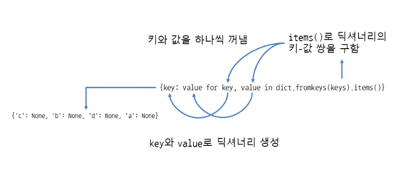
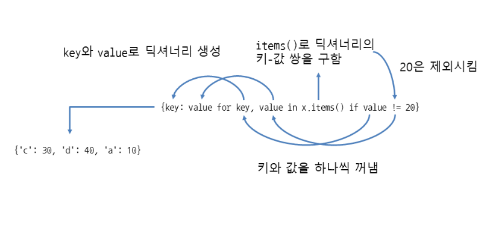

# 딕셔너리 응용하기
## 딕셔너리 딕셔너리에 키 - 값 쌍 추가하기
- setdefault: 키-값 쌍 추가
- update: 키의 값 수정, 키가 없으면 키-값 쌍 추가
update(반복가능한객체)는 키-값 쌍으로 된 반복 가능한 객체로 값을 수정

## 딕셔너리에서 키 - 값 쌍 삭제하기
- pop(키)는 딕셔너리에서 특정 키-값 쌍을 삭제한 뒤 삭제한 값을 반환
- popitem()은 딕셔너리에서 임의의 키-값 쌍을 삭제한 뒤 삭제한 키-값 쌍을 튜플로 반환

## 딕셔너리에서 키의 값을 가져오기
- get(키)는 딕셔너리에서 특정 키의 값을 가져옵
- items: 키-값 쌍을 모두 가져옴
- keys: 키를 모두 가져옴
- values: 값을 모두 가져옴

## 리스트와 튜플로 딕셔너리 만들기
- dict.fromkeys(키리스트)는 키 리스트로 딕셔너리를 생성하며 값은 모두 None으로 저장
- dict.fromkeys(키리스트, 값)

## 반복문으로 딕셔너리의 키- 값 쌍을 모두 출력하기

## 딕셔너리 표현식 사용하기
- {키: 값 for 키, 값 in 딕셔너리}
- dict({키: 값 for 키, 값 in 딕셔너리})


## 딕셔너리 표현식에서 if 조건문 사용하기

- {키: 값 for 키, 값 in 딕셔너리 if 조건식}
- dict({키: 값 for 키, 값 in 딕셔너리 if 조건식})



## 딕셔너리 안에서 딕셔너리 사용하기
- 딕셔너리 = {키1: {키A: 값A}, 키2: {키B: 값B}}
- 딕셔너리[키][키]
- 딕셔너리[키][키] = 값
```
terrestrial_planet = {
    'Mercury': {
        'mean_radius': 2439.7,
        'mass': 3.3022E+23,
        'orbital_period': 87.969
    },
    'Venus': {
        'mean_radius': 6051.8,
        'mass': 4.8676E+24,
        'orbital_period': 224.70069,
    },
    'Earth': {
        'mean_radius': 6371.0,
        'mass': 5.97219E+24,
        'orbital_period': 365.25641,
    },
    'Mars': {
        'mean_radius': 3389.5,
        'mass': 6.4185E+23,
        'orbital_period': 686.9600,
    }
}
 
print(terrestrial_planet['Venus']['mean_radius'])    # 6051.8
```

## 딕셔너리 할당과 복사
- 먼저 딕셔너리를 만든 뒤 다른 변수에 할당함