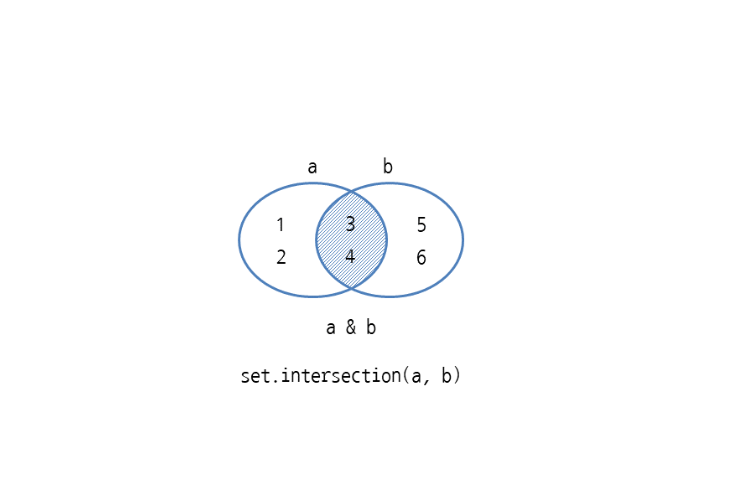

# 세트 만들기
- 세트는 { }(중괄호) 안에 값을 저장하며 각 값은 ,(콤마)로 구분
- 중복 / 순서 없음
- 세트 = {값1, 값2, 값3}

## set 에서 특정 값이 있는지 확인
- 값 in 세트

## 집협 연산 사용하기
-  집합 연산은 파이썬의 산술 연산자와 논리 연산자를 활용

### 합집합
- 세트1 | 세트2
- set.union(세트1, 세트2)


```
>>> a = {1, 2, 3, 4}
>>> b = {3, 4, 5, 6}
>>> a | b
{1, 2, 3, 4, 5, 6}
>>> set.union(a, b)
{1, 2, 3, 4, 5, 6}
```
### 교집합
- 세트1 & 세트2
- set.intersection(세트1, 세트2)


### 차집합
- 세트1 - 세트2
- set.difference(세트1, 세트2)


### 대칭 차집합
- 세트1 ^ 세트2
- set.symmetric_difference(세트1, 세트2)


## 집합 연산 후 할당 연산자 사용하기
- 세트1 |= 세트2
- 세트1.update(세트2)
- 세트1 &= 세트2
- 세트1.intersection_update(세트2)
- 세트1 -= 세트2
- 세트1.difference_update(세트2)
- 세트1 ^= 세트2
- 세트1.symmetric_difference_update(세트2)

## 부분 집합과 상위 집합 확인하기
- 현재세트 <= 다른세트
- 현재세트.issubset(다른세트)


- 현재세트 < 다른세트


- 현재세트 >= 다른세트
- 현재세트.issuperset(다른세트)


- 현재세트 > 다른세트


## 세트에 요소 
- add(요소)는 세트에 요소를 추가
- remove(요소)는 세트에서 특정 요소를 삭제
- discard(요소)는 세트에서 특정 요소를 삭제하고 요소가 없으면 그냥 넘어감
- pop()은 세트에서 임의의 요소를 삭제하고 해당 요소를 반환
- clear()는 세트에서 모든 요소를 삭제
- len(세트)는 세트의 요소 개수(길이)를 구함

## 반복문으로 세트의 요소를 모두 출력하기
```
for 변수 in 세트:
     반복할 코드
```

## 세트 표현식 사용하기
- {식 for 변수 in 반복가능한객체}
- set(식 for 변수 in 반복가능한객체)
- {식 for 변수 in 세트 if 조건식}
- set(식 for 변수 in 세트 if 조건식)

