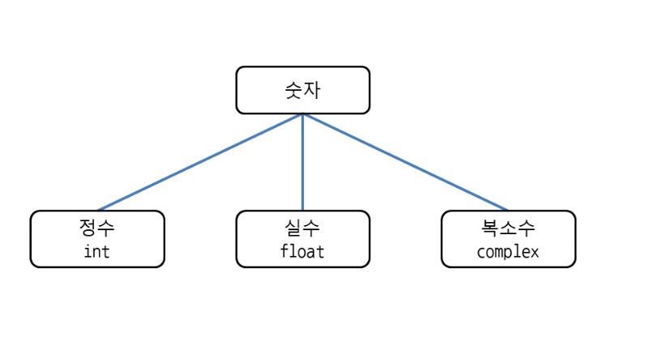
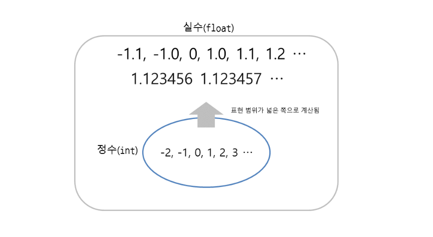

# 숫자 계산하기
- 숫자를 정수, 실수 , 복소수로 구분



## 사칙연산
-  더하기 +
- 빼기 -
- 곱셈 *
- 나눗셈 /
- 나눗셈 후 소수점 이하 버리는 연산 //
- 나눗셈 후 나머지구하는 연산 %
- 값을 정수로 만들기 int()
```
int(숫자)
int(계산식)
int('문자열')
```
- 객체의 자료형 알아내기 type
- 몫과 나머지 함계 구하기 divmod(5,2)
      -튜플 형태로 반환
```
참고 | 진수, 8진수, 16진수
정수는 10진수 이외에도 2진수, 8진수, 16진수로도 표현할 수 있습니다.

2진수: 숫자 앞에 0b를 붙이며 0과 1을 사용합니다.

8진수: 숫자 앞에 0o(숫자 0과 소문자 o)를 붙이며 0부터 7까지 사용합니다.

16진수: 숫자 앞에 0x 또는 0X를 붙이며 0부터 9, A부터 F까지 사용합니다(소문자 a부터 f도 가능).

>>> 0b110
6
>>> 0o10
8
>>> 0xF
15
```

## 실수와 정수를 함께 계산시 
- 실수로 계산됨


## 값을 실수로 만들기
```
float(숫자)
float(계산식)
float('문자열')
>>> float(5)
5.0
>>> float(1 + 2)
3.0
>>> float('5.3')
5.3
```

## 괄호 사용하기
- 사칙 연산에 우선순위에서
괄호를 넣어서 우리가 원하는 우선 순위 대로 처리
```
>>> 35 + 1 * 2
37
만약 곱셈보다 덧셈을 먼저 계산하고 싶다면 덧셈 부분을 괄호로 묶어주면 됩니다.

>>> (35 + 1) * 2
72
```