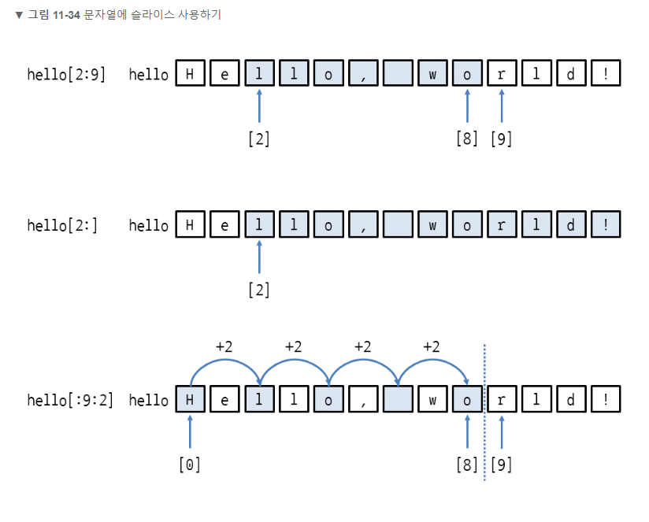

# 시퀀스 자료형 활용하기
- 값이 연속적으로 이어저 있는 자료형
- 리스트, 튜플, range, 문자열


### 특징
- 공통된 동작과 기능을 제공
- 시퀀스 자료형으로 만든 객체를 시퀀스 객체라고 함
- 각 값을 요소라고 부름


## 특정 값이 있는지 확인하기
in
- 값 in 시퀀스객체
- 값 not in 시퀀스객체
```
>>> a = [0, 10, 20, 30, 40, 50, 60, 70, 80, 90]
>>> 30 in a
True
>>> 100 in a
False


>>> 43 in (38, 76, 43, 62, 19)
True
>>> 1 in range(10)
True
>>> 'P' in 'Hello, Python'
True
```
## 시퀀스 객체 연결하기
- 시퀀스객체1 + 시퀀스객체2


```
>>> a = [0, 10, 20, 30]
>>> b = [9, 8, 7, 6]
>>> a + b
[0, 10, 20, 30, 9, 8, 7, 6]

단, 시퀀스 자료형 중에서 range는 + 연산자로 객체를 연결할 수 없습니다.

>>> range(0, 10) + range(10, 20)
Traceback (most recent call last):
  File "<pyshell#1>", line 1, in <module>
    range(0, 10) + range(10, 20)
TypeError: unsupported operand type(s) for +: 'range' and 'range'

이때는 range를 리스트 또는 튜플로 만들어서 연결하면 됩니다.

>>> list(range(0, 10)) + list(range(10, 20))
[0, 1, 2, 3, 4, 5, 6, 7, 8, 9, 10, 11, 12, 13, 14, 15, 16, 17, 18, 19]
>>> tuple(range(0, 10)) + tuple(range(10, 20))
(0, 1, 2, 3, 4, 5, 6, 7, 8, 9, 10, 11, 12, 13, 14, 15, 16, 17, 18, 19)
```

## 문자열 + 정수/실수
- 문자열' + str(정수)
- 문자열' + str(실수)
```
그냥 문자열 + 숫자일 경우에러 발생
'Hello, ' + 10
Traceback (most recent call last):
  File "<pyshell#2>", line 1, in <module>
    'Hello, ' + 10
TypeError: Can't convert 'int' object to str implicitly 

```

## 시퀀스 객체 반복하기
\* 연산자는 시퀀스 객체를 특정 횟수만큼 반복하여 새 시퀀스 객체를 만듬
- 시퀀스객체 * 정수
- 정수 * 시퀀스객체


## 리스트와 튜플의 요소 개수 구하기
- len(a)
```
>>> a = [0, 10, 20, 30, 40, 50, 60, 70, 80, 90]
>>> len(a)
10
```


## range의 숫자 생성 개수 구하기
```
 len(range(0, 10, 2))
```


## 문자열의 길이 구하기
```
>>> hello = 'Hello, world!'
>>> len(hello)
13

>>> hello = '안녕하세요'
>>> len(hello.encode('utf-8'))
15

```


## 인덱스 사용하기
- 시퀀스객체[인덱스]
```
>>> a = [38, 21, 53, 62, 19]
>>> a[0]    # 리스트의 첫 번째(인덱스 0) 요소 출력
38
>>> a[2]    # 리스트의 세 번째(인덱스 2) 요소 출력
53
>>> a[4]    # 리스트의 다섯 번째(인덱스 4) 요소 출력
19
```


### __getitem__ 메서드
- 시퀀스 객체에서 [] 대괄호를 사용하면 실제로는 __getitem__ 메서드를 호출하여 요소를 가져옴
- 시퀀스객체.__getitem__(인덱스)
```
>>> a = [38, 21, 53, 62, 19]
>>> a.__getitem__(1)
21
```

## 음수 인덱스 지정하기
- 시퀀스 객체에서 인덱스를 음수로 지정하면 뒤에서부터 요소에 접근


## 인덱스의 범위를 벗어나면
- IndexError 발생
```
>>> a = [38, 21, 53, 62, 19]
>>> a[5]    # 인덱스 5는 범위를 벗어났으므로 에러
Traceback (most recent call last):
  File "<pyshell#1>", line 1, in <module>
    a[5]
IndexError: list index out of range 
```
## 인덱스의 마지막 요소에 접근 하는 방법

```
 len(a)에서 1을 빼주어야 인덱스가 범위를 벗어나지 않음
a[len(a) - 1]  
```

## 요소에 값 할당 하기
- 시퀀스객체[인덱스] = 값
```
>>> a = [0, 0, 0, 0, 0]    # 0이 5개 들어있는 리스트
>>> a[0] = 38
>>> a[1] = 21
>>> a[2] = 53
>>> a[3] = 62
>>> a[4] = 19
>>> a
[38, 21, 53, 62, 19]
>>> a[0]
38
>>> a[4]
19
```

## del 로 요소 삭제하기
- del 시퀀스객체[인덱스]
```
>>> a = [38, 21, 53, 62, 19]
>>> del a[2]
>>> a

튜플은 삭제할 수 없음
b = (38, 21, 53, 62, 19)
>>> del b[2]
Traceback (most recent call last):
  File "<pyshell#7>", line 1, in <module>
    del b[2]
TypeError: 'tuple' object doesn't support item deletion 

마찬가지로 range와 문자열도 안에 저장된 요소를 삭제할 수 없음
>>> r = range(0, 10, 2)
>>> del r[2]
Traceback (most recent call last):
  File "<pyshell#8>", line 1, in <module>
    del r[2]
TypeError: 'range' object doesn't support item deletion 
>>> hello = 'Hello, world!'
>>> del hello[2]
Traceback (most recent call last):
  File "<pyshell#9>", line 1, in <module>
    del hello[2]
TypeError: 'str' object doesn't support item deletion 
```

## 슬라이스 사용하기
- 시퀀스객체[시작인덱스:끝인덱스]
- a[1:1] 처럼 시작 인덱스와 끝 인덱스를 같은 숫자로 지정하면 아무것도 가져오지 않음
- a[1:2] 처럼 끝 인덱스에 1을 더 크게 지정해야 요소 하나를 가져옴
- 슬라이스 했을 때 실제로 가져오는 요소는 시작 인덱스 부터 끝 인덱스 -1까지임
```
>> a = [0, 10, 20, 30, 40, 50, 60, 70, 80, 90]
>>> a[0:4]     # 인덱스 0부터 3까지 잘라서 새 리스트를 만듦
[0, 10, 20, 30]
```


## 리스트의 중간 부분 가져오기
```
>>> a = [0, 10, 20, 30, 40, 50, 60, 70, 80, 90]
>>> a[4:7]     # 인덱스 4부터 6까지 요소 3개를 가져옴
[40, 50, 60]
```


## 인득스 증가폭을 사용하기
- 시퀀스객체[시작인덱스:끝인덱스:인덱스증가폭]

```
>>> a = [0, 10, 20, 30, 40, 50, 60, 70, 80, 90]
>>> a[2:8:3]    # 인덱스 2부터 3씩 증가시키면서 인덱스 7까지 가져옴
[20, 50]
```


## 인덱스 생략하기
- 시퀀스객체[:끝인덱스]
- 시퀀스객체[시작인덱스:]
-  시퀀스객체[:]
- 시작 인덱스를 생략하면 리스트의 처음부터 끝까지 가져옴


```
>>> a = [0, 10, 20, 30, 40, 50, 60, 70, 80, 90]
>>> a[:7]    # 리스트 처음부터 인덱스 6까지 가져옴
[0, 10, 20, 30, 40, 50, 60]

a[7:]    # 인덱스 7부터 마지막 요소까지 가져옴
[70, 80, 90]

>>> a[:]     # 리스트 전체를 가져옴
[0, 10, 20, 30, 40, 50, 60, 70, 80, 90]
```

## 인덱스를 생략하면서 증가폭 사용하기
- 시퀀스객체[:끝인덱스:증가폭]
- 시퀀스객체[::증가폭]
```
>>> a = [0, 10, 20, 30, 40, 50, 60, 70, 80, 90]
>>> a[:7:2]    # 리스트의 처음부터 인덱스를 2씩 증가시키면서 인덱스 6까지 가져옴
[0, 20, 40, 60]
```


## len을 응용하기
```
>>> a = [0, 10, 20, 30, 40, 50, 60, 70, 80, 90]
>>> a[0:len(a)]    # 시작 인덱스에 0, 끝 인덱스에 len(a) 지정하여 리스트 전체를 가져옴
[0, 10, 20, 30, 40, 50, 60, 70, 80, 90]
>>> a[:len(a)]     # 시작 인덱스 생략, 끝 인덱스에 len(a) 지정하여 리스트 전체를 가져옴
[0, 10, 20, 30, 40, 50, 60, 70, 80, 90]

리스트 a의 요소는 10개입니다. 따라서 len(a)는 10이고, a[0:10]과 같습니다. 여기서 끝 인덱스는 가져오려는 인덱스보다 1을 더 크게 지정한다고 했으므로 len(a)에서 1을 빼지 않아야 합니다. 즉, 길이가 10인 리스트는 [0:10]이라야 리스트 전체를 가져옵니다.
```

## 튜플, range, 문자열에 슬라이스 사용하기
- 튜플[시작인덱스:끝인덱스]
- 튜플[시작인덱스:끝인덱스:인덱스증가폭]


```
>>> b = (0, 10, 20, 30, 40, 50, 60, 70, 80, 90)
>>> b[4:7]     # 인덱스 4부터 6까지 요소 3개를 가져옴
(40, 50, 60)
>>> b[4:]      # 인덱스 4부터 마지막 요소까지 가져옴
(40, 50, 60, 70, 80, 90)
>>> b[:7:2]    # 튜플의 처음부터 인덱스를 2씩 증가시키면서 인덱스 6까지 가져옴
(0, 20, 40, 60)
```

- range객체[시작인덱스:끝인덱스]
- range객체[시작인덱스:끝인덱스:인덱스증가폭]


```
range는 리스트, 튜플과는 달리 요소가 모듀 표시되지 않고
생성 범위만 표시됨

잘라냄 range 객체를 리스트로 만들려면 list에 넣으면 됨
>>> list(r[:7:2])
[0, 2, 4, 6]
```

- 문자열[시작인덱스:끝인덱스]
- 문자열[시작인덱스:끝인덱스:인덱스증가폭]


```
>>> hello = 'Hello, world!'
>>> hello[2:9]    # 인덱스 2부터 인덱스 8까지 잘라서 문자열을 만듦
'llo, wo'
>>> hello[2:]     # 인덱스 2부터 마지막 요소까지 잘라서 문자열을 만듦
'llo, world!'
>>> hello[:9:2]   # 문자열의 처음부터 인덱스를 2씩 증가시키면서 인덱스 8까지 잘라서 문자열을 만듦
'Hlo o'
```

## 슬라이스에 요소 할당하기
- 시퀀스객체[시작인덱스:끝인덱스] = 시퀀스객체
- 시퀀스객체[시작인덱스:끝인덱스:인덱스증가폭] = 시퀀스객체


```
단, 인덱스 증가폭을 지정했을 때는 슬라이스 범위의 요소 개수와 할당할 요소 개수가 정확히 일치해야 합니다.

>>> a = [0, 10, 20, 30, 40, 50, 60, 70, 80, 90]
>>> a[2:8:2] = ['a', 'b']
Traceback (most recent call last):
  File "<pyshell#1>", line 1, in <module>
    a[2:8:2] = ['a', 'b']
ValueError: attempt to assign sequence of size 2 to extended slice of size 3 

튜플, range, 문자열은 슬라이스 범위를 지정하더라도 요소를 할당할 수 없습니다.

>>> b = (0, 10, 20, 30, 40, 50, 60, 70, 80, 90)
>>> b[2:5] = ('a', 'b', 'c')
Traceback (most recent call last):
  File "<pyshell#2>", line 1, in <module>
    b[2:5] = ('a', 'b', 'c')
TypeError: 'tuple' object does not support item assignment 
>>> r = range(10)
>>> r[2:5] = range(0, 3)
Traceback (most recent call last):
  File "<pyshell#4>", line 1, in <module>
    r[2:5] = range(0, 3)
TypeError: 'range' object does not support item assignment 
>>> hello = 'Hello, world!'
>>> hello[7:13] = 'Python'
Traceback (most recent call last):
  File "<pyshell#6>", line 1, in <module>
    hello[7:13] = 'Python'
TypeError: 'str' object does not support item assignment 
```

##   del로 슬라이스 삭제하기
- del 시퀀스객체[시작인덱스:끝인덱스]
```
>>> a = [0, 10, 20, 30, 40, 50, 60, 70, 80, 90]
>>> del a[2:5]    # 인덱스 2부터 4까지 요소를 삭제
>>> a
[0, 10, 50, 60, 70, 80, 90]
```


```
물론 튜플, range, 문자열은 del로 슬라이스를 삭제할 수 없습니다.
>>> b = (0, 10, 20, 30, 40, 50, 60, 70, 80, 90)
>>> del b[2:5]
Traceback (most recent call last):
  File "<pyshell#8>", line 1, in <module>
    del b[2:5]
TypeError: 'tuple' object does not support item deletion 
>>> r = range(10)
>>> del r[2:5]
Traceback (most recent call last):
  File "<pyshell#10>", line 1, in <module>
    del r[2:5]
TypeError: 'range' object does not support item deletion 
>>> hello = 'Hello, world!'
>>> del hello[2:9]
Traceback (most recent call last):
  File "<pyshell#12>", line 1, in <module>
    del hello[2:9]
TypeError: 'str' object does not support item deletion 
```